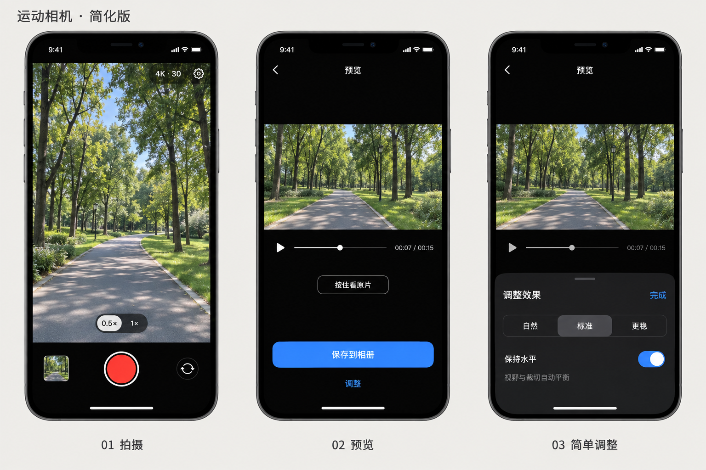

# iPhone 运动相机：首版 UI 定稿

2026-09-11 用户确认采用本方案，后续实现以 V2 为准。当前 0.2.0 已实现录制、标准稳定处理、前台队列和原片／稳定结果切换；调整面板和 GPU 优化按后续里程碑加入，真机效果仍需验收。

主流程：**拍摄 → 预览 → 保存到相册**。

## 三个界面

| 界面 | 保留的内容 | 行为 |
| --- | --- | --- |
| 拍摄 | 取景、录制按钮、可用镜头、规格入口、素材缩略图、设置入口 | 打开即可拍摄；停止后留在相机页，自动开始稳定处理，允许继续拍下一段。 |
| 预览 | 视频、播放、按住看原片、保存到相册、调整 | 默认展示稳定效果；对比保持相同播放时间；无须进入调整即可保存。 |
| 简单调整 | 自然／标准／更稳、保持水平、完成 | 使用底部面板，修改后更新预览；完成返回预览。 |

拍摄页采用全屏取景，顶部信息、镜头选择和底部录制控件覆盖在画面上；控件避开安全区，仅用半透明渐变增强可读性。取景以等比填充显示，屏幕与视频比例不同时裁切预览边缘，保存原片仍保持原始尺寸和内参。

## 默认行为

- 默认「标准」，「保持水平」默认关闭；用户修改后记住偏好。
- 开启「保持水平」时使用重力信息，保留转向和运镜；不提供 Fixed camera 模式。
- 动态缩放自动平衡稳定性、视野和边缘覆盖；首版不显示裁切倍数、FOV 或算法数值。
- 原片和配套运动数据保留，支持重新调整和导出；删除素材时明确提示会一并删除哪些内容。
- 导出采用与素材及有效画质匹配的默认规格，正常流程不弹出参数选择页；保存按钮触发必要的最终导出。

## 状态与入口

- 缩略图承载处理进度；正在处理的素材进入预览时显示简短状态，完成后展示稳定结果。
- 素材列表从缩略图进入，采用普通网格，不增加主导航栏。
- 拍摄优先。处理任务按设备负载暂停或继续；温度过高、存储不足、导出失败在当前界面给出必要提示与恢复动作。
- 首次使用按需请求相机、麦克风及保存相册权限。
- 齿轮只承载必要的拍摄和存储设置；不增加专业参数页、独立任务中心或独立导出配置页。
- 付费入口和价格另行确定，不插入首次拍摄和预览流程。

## 首版验收

- 默认设置下，用户完成「录制 → 打开缩略图 → 保存」即可得到稳定视频。
- 调整面板只有三档稳定程度和一个保持水平开关。
- 保存过程中显示真实进度；成功后确认已写入相册，失败可重试。
- 预览与导出使用同一套参数；视频方向、宽高比、音画同步正确。
- 拍摄不中断已有素材，处理失败不丢失原片与运动数据。

参考图中的景色、播放时长和设备控件仅为示意；实际镜头选项随支持的设备与采集模式显示。

## 2026-09-12 用户追加配置（0.3.0）

按本轮要求扩展为自动横竖屏拍摄，并以强度滑块、最大裁切 1–5×、动态裁切开关、允许黑边开关替代原定三档调整面板。设置页保存默认值，预览页为单素材配置并重新生成。录制开始时锁定显示方向；旋转期间不改变采集像素和内参。保持水平尚未实现。以上覆盖旧稿中“不显示裁切倍数”和“仅三档”的限制。

## 2026-09-12 素材管理与 UI 整理（0.6.0）

采用[素材管理与界面整理方案](library-refinement.md)：日期分组双列素材网格、长按与批量删除、全屏播放顶部版本切换、底部调整与导出，以及更多菜单。原片保留至用户确认删除；系统相册副本独立保留。
