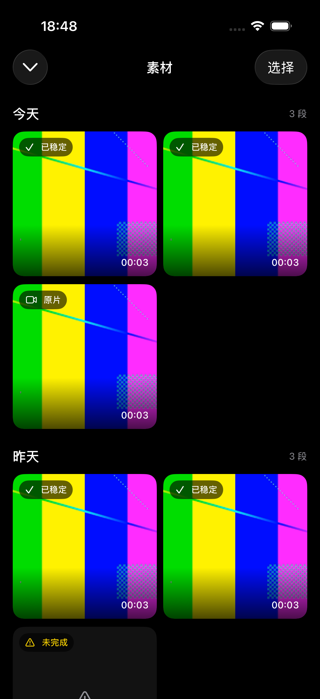
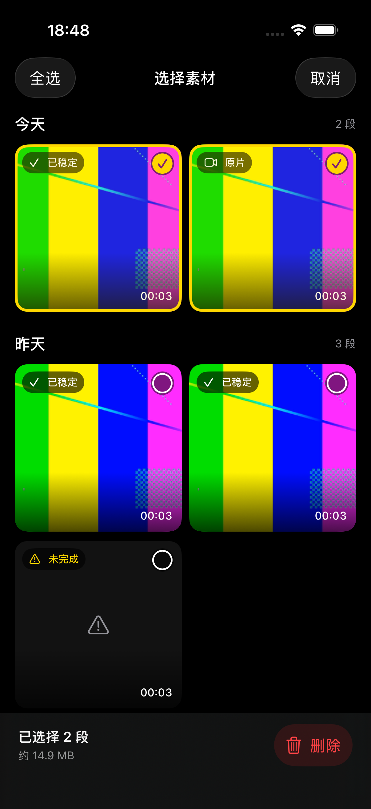
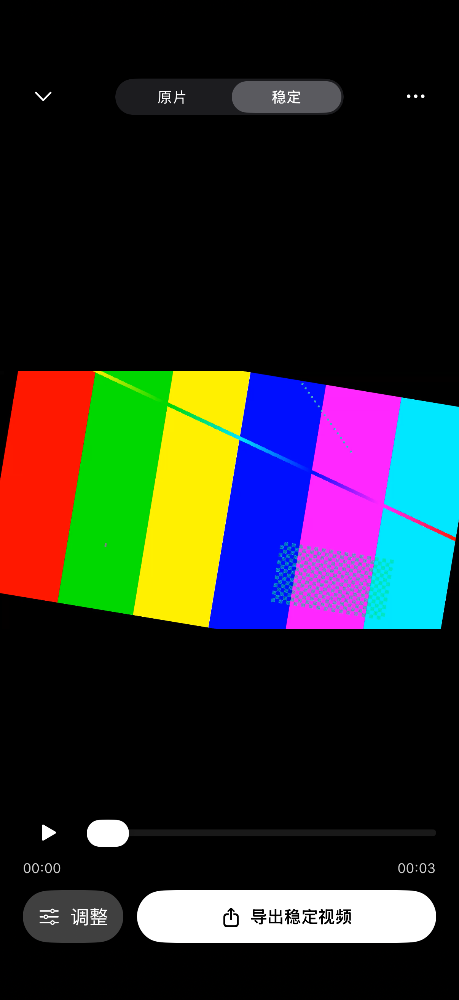
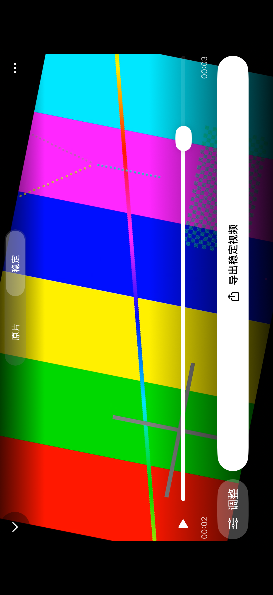

# 素材管理与界面整理 · 2026-09-12

本轮直接实现到 SwiftUI。保留「拍摄 → 素材 → 全屏播放 → 导出」路径。0.6.0 使用深色背景、白色主要控件；0.6.1 已将设置与导出更新为[彩色控件](settings-color.md)。拍摄与素材选择仍使用黄色，录制和删除使用红色。

| 界面 | 布局 | 操作 |
| --- | --- | --- |
| 拍摄 | 全屏取景；顶部格式与设置；底部镜头、素材、录制 | 保持现有录制行为，统一圆形按钮和格式胶囊，不在取景器显示处理进度 |
| 素材 | 日期分组；双列等宽缩略图；角标显示状态、时长 | 点开全屏；长按可删除或选择；顶部「选择」进入批量模式 |
| 批量选择 | 顶部「全选／取消」；缩略图选中圆标；底部选择数量、约占空间及删除 | 确认后删除；成功项立即移除，失败项保留并提示；删除期间阻止重复操作 |
| 播放 | 全屏等比显示；顶部「原片／稳定」切换及更多；底部进度、调整、导出 | 点击画面隐藏控件；切换版本保留时间和播放状态；更多包含素材信息及删除 |

## 删除流程

1. 长按素材、批量模式或播放页更多菜单发起删除。
2. 确认框写明数量、估计空间，以及「原片、稳定视频和运动数据一起删除；已保存到系统相册的视频保留；删除后无法恢复」。
3. 停止播放，禁止新任务入队，移除待处理任务，取消目标素材的当前任务并等待音视频工作线程结束。
4. 仅删除 Recordings 下选中的直接子目录及其内容。保留其他素材和系统相册。
5. 刷新素材列表和选择状态。正在处理时占用空间会变化，因此确认框使用「约」。

第一版采用系统删除确认，不增加独立回收站页面。未完成录制仍可查看状态和删除；不会把未封装视频显示成可正常播放。

## 交互细节

- 缩略图不再在下面堆叠日期和处理说明；日期成为组标题，状态成为小角标。
- 原片／稳定切换只在稳定结果存在时启用；导出明确标记当前版本，防止误保存原片。
- 导出期间禁止切换版本、重新处理和删除；导出捕获固定文件 URL。
- 调整保留现有强度、裁切、允许黑边、1080p／2.8K 配置，重新生成成功前保留上一版。
- 播放保持 resizeAspect，保留编码画面、宽高比和真实黑边。
- 点击区域至少 44pt；横屏与较大字体下允许控件换行，素材网格保持双列。

## 本轮验收范围

本机单元测试、删除与队列竞争测试、模拟器合成素材的界面和删除操作、iPhone Release 构建。手机暂用于其他工作，本轮不安装、不启动手机 App。4K60 实拍丢帧验收仍单独待办。

## 已实现界面

以下为模拟器实际截图，彩条是合成测试视频。

| 素材 | 批量选择 | 全屏播放 |
| --- | --- | --- |
|  |  |  |

